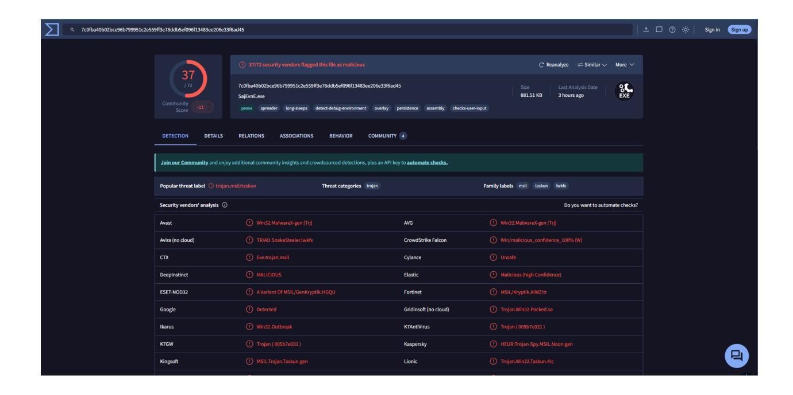
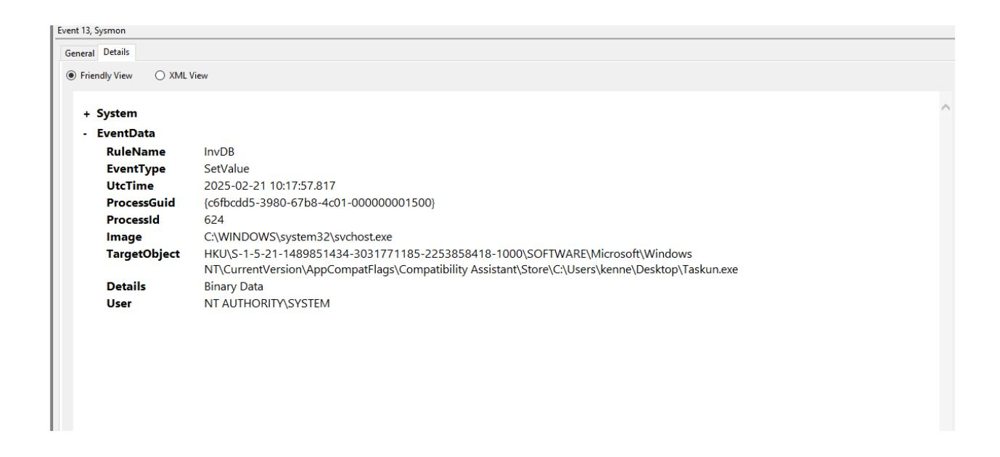
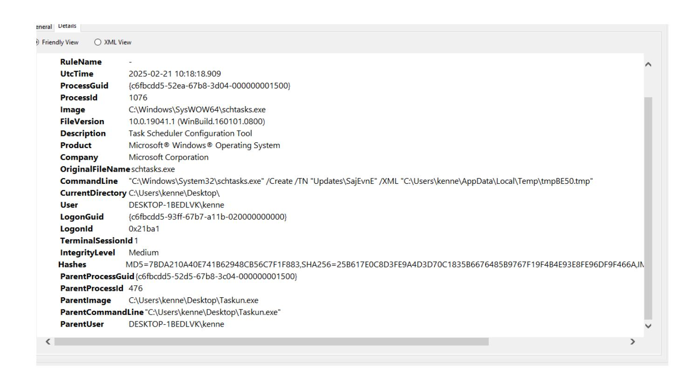
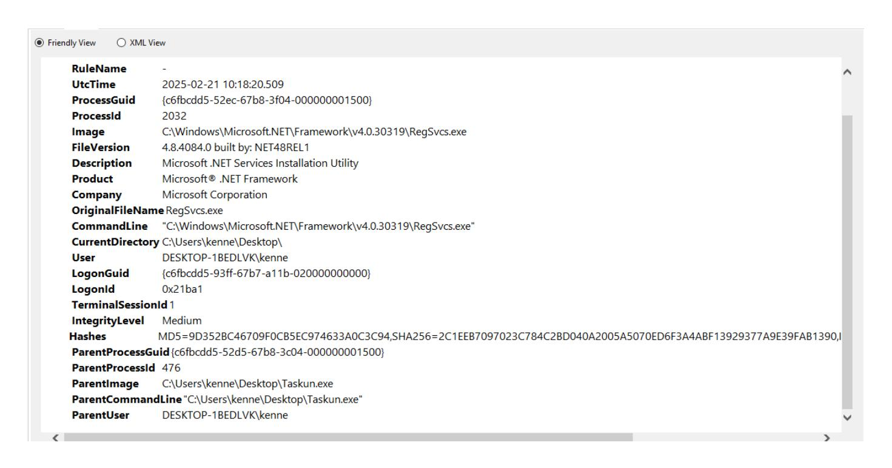
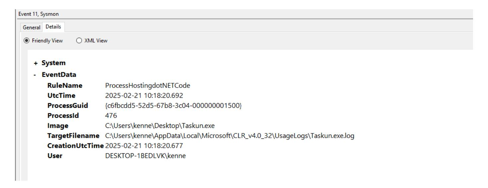
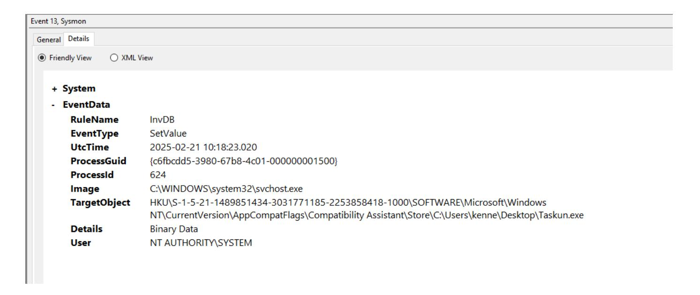
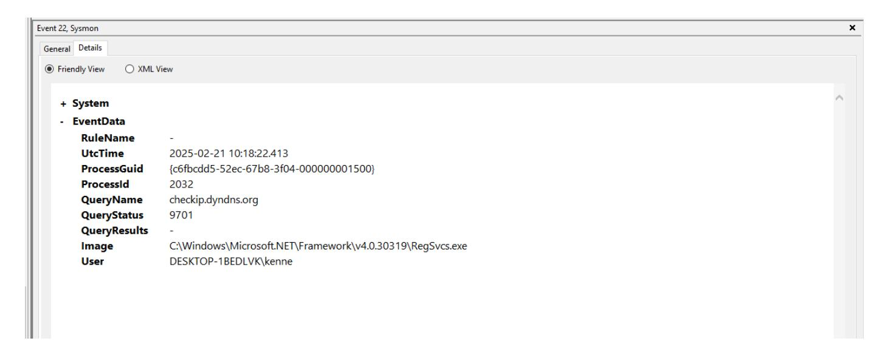
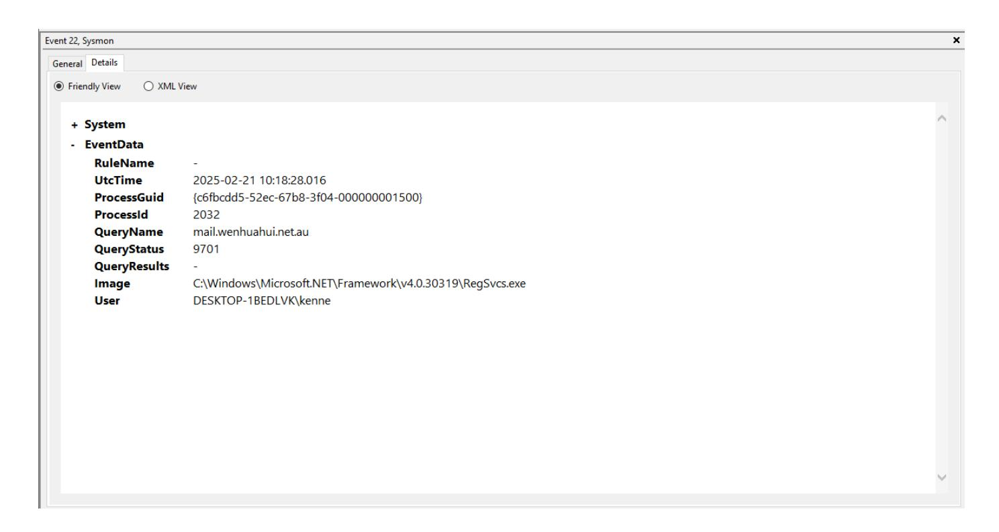
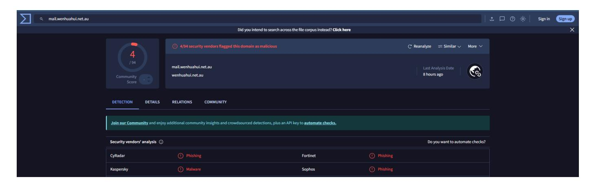
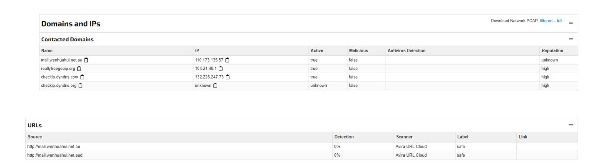

# **Taskun Malware Investigation Report**

*Prepared by: Kennedy .E. Aikohi*

*Date:21/02/2025*

*Category: Advanced Threat Investigation*

*Tools Used: Sysmon, VirusTotal, Joe Sandbox*

# **Overview**

**Threat Name**: Commonly known as trojan.msil/taskun

**Threat Categories**: Trojan

**Family Labels**: MSIL, Taskun, LWKFX

## **Basic Properties**:

● **MD5**: f229cfa9f9f9fc4171cc1105a3edd39c

● **SHA-1**: a6810fe4d4e923044b2de330a73b1d19c56571c7

● **SHA-256**: 7c0fba40b02bce96b799951c2e559ff3e78ddb5ef096f13483ee206e33f6ad45

● **Vhash**: 295036751514a0f8ffcd756b56f

● **Authentihash**: 37bcb1326480ee078b9f82333477b349fd3ad00920f4108f18cc4cf107937ea3

● **Imphash**: f34d5f2d4577ed6d9ceec516c1f5a744

### ● **SSDEEP**:

12288:Iut7MC3WFTrF7J3rCkEC15/nXmwdFZUE6SZezARYhb5VqssQQH6kR:UrrfWoIE 6SZACEunHZ

### ● **TLSH**:

T18315AEC03320AB1AED6F4B31D01ADEB5D2B05597B089FBD96DC96B9F38C9300 5998B47

**File Type**: Win32 EXE executable, windows, win32, pe, peexe

**Magic**: PE32 executable (GUI) Intel 80386 Mono/.Net assembly, for MS Windows

Generic CIL Executable (.NET, Mono, etc.) (69.7%)

- Win64 Executable (generic) (10%)
- Win32 Dynamic Link Library (generic) (6.2%)
- Win32 Executable (generic) (4.2%)
- Win16/32 Executable Delphi generic (1.9%)
- PE32
- Library: .NET (v4.0.30319)
- Linker: Microsoft Linker
- Sign tool: Windows Authenticode (2.0) [PKCS #7]
- **Magika**: PEBIN
- **File Size**: 881.51 KB (902664 bytes)
- **PEiD Packer**: .NET executable

### **History**:

● **Creation Time**: 2025-02-20 02:35:36 UTC

● **First Seen In The Wild**: 2025-02-20 04:00:00 UTC

● **First Submission**: 2025-02-20 05:11:51 UTC

● **Last Submission**: 2025-02-20 05:11:51 UTC

● **Last Analysis**: 2025-02-21 11:10:02 UTC

### **Names**:

● SajEvnE.exe

● Bank Slip pdf (2).exe

### **Portable Executable Info**: **.NET Details**:

● **Module Version Id**: 0c3f34a3-484a-4e4c-a750-015cce77b536

● **Header**:

○ **Target Machine**: Intel 386 or later processors and compatible processors

○ **Compilation Timestamp**: 2025-02-20 02:35:36 UTC

○ **Entry Point**: 893730

○ **Contained Sections**: 3

**Malware Sample Source**: Collected from Malware Bazar for analysis

### **Initial Process Creation**

The investigation of Taskun malware begins with the first process created upon execution. At **UTC Time 2025-02-21 10:17:57.789**, a process with Process GUID

**{c6fbcdd5-52d5-67b8-3c04-000000001500}** and Process ID **476** was launched. The image file is located at **C:\Users\kenne\Desktop\Taskun.exe** and is described as a Microsoft PDF Document with the File Version **2.0.0.781**. The file is identified as **Adobe Reader** , but its original name is **hyQc.exe**.

The malware's process was executed using the command line

**"C:\Users\kenne\Desktop\Taskun.exe"** in the current directory **C:\Users\kenne\Desktop**. The user associated with this execution is **DESKTOP-1BEDLVK\kenne**, with a Logon GUID **{c6fbcdd5-93ff-67b7-a11b-020000000000}** and Logon ID **0x21ba1**. The process ran in a terminal session with ID **1** and had an Integrity Level of **Medium**.

### **Process Hashes:**

● **MD5:** F229CFA9F9F9FC4171CC1105A3EDD39C

● **SHA-256:**

7C0FBA40B02BCE96B799951C2E559FF3E78DDB5EF096F13483EE206E33F6AD45

● **IMPHASH:** F34D5F2D4577ED6D9CEEC516C1F5A744

**Parent Process:** The parent process had a Process GUID

**{c6fbcdd5-9413-67b7-6b00-000000001500}** and Process ID **4748**, running from the image

**C:\Windows\explorer.exe** with the command line **C:\WINDOWS\Explorer.EXE**. The parent

user is **DESKTOP-1BEDLVK\kenne**.

**Initial Access:** Execution of malicious file T1071.001

**Persistence Mechanisms**

Shortly after execution, Taskun malware attempts to establish persistence using the following

techniques..

**Taskun attempts to modify the registry to achieve persistence:**

● **Source Process:** C:\Users\kenne\Desktop\Taskun.exe

● **Process ID:** 476

● **User:** DESKTOP-1BEDLVK\kenne

● **Logon ID:** 0x21ba1

● **Integrity Level:** Medium

**Persistence:** Modify registry T1547.001

## **Scheduled Task Creation**

After the initial process creation, the Taskun malware attempted to create a scheduled task using **schtasks.exe**.

At **UTC Time 2025-02-21 10:18:18.909**, a process with Process GUID

**{c6fbcdd5-52ea-67b8-3d04-000000001500}** and Process ID **1076** was launched. The image file is located at **C:\Windows\SysWOW64\schtasks.exe** and is described as the Task Scheduler Configuration Tool with the File Version **10.0.19041.1 (WinBuild.160101.0800)**. This file is a component of the **Microsoft® Windows® Operating System** by Microsoft Corporation, with the original file name **schtasks.exe**.

The process was executed using the command line **"C:\Windows\System32\schtasks.exe"**

**/Create /TN "Updates\SajEvnE" /XML**

**"C:\Users\kenne\AppData\Local\Temp\tmpBE50.tmp"** in the current directory

**C:\Users\kenne\Desktop**. The user associated with this execution is

**DESKTOP-1BEDLVK\kenne**, with a Logon GUID **{c6fbcdd5-93ff-67b7-a11b-020000000000}** and Logon ID **0x21ba1**. The process ran in a terminal session with ID **1** and had an Integrity Level of **Medium**.

### **Process Hashes:**

- **MD5:** 7BDA210A40E741B62948CB56C7F1F883
- **SHA-256:**

25B617E0C8D3FE9A4D3D70C1835B6676485B9767F19F4B4E93E8FE96DF9F466A

● **IMPHASH:** F17EC07B6AFEC23E66CD1D082F9A6930

**Parent Process:** The parent process had a Process GUID

**{c6fbcdd5-52d5-67b8-3c04-000000001500}** and Process ID **476**, running from the image

**C:\Users\kenne\Desktop\Taskun.exe** with the command line

**"C:\Users\kenne\Desktop\Taskun.exe"**. The parent user is **DESKTOP-1BEDLVK\kenne**.

**Persistence:** Create scheduled task T1053.005

**RegSvcs Process Initiation**

After creating the scheduled task, the Taskun malware initiated another process.

At **UTC Time 2025-02-21 10:18:20.509**, a process with Process GUID

**{c6fbcdd5-52ec-67b8-3f04-000000001500}** and Process ID **2032** was launched. The image file is

located at **C:\Windows\Microsoft.NET\Framework\v4.0.30319\RegSvcs.exe** and is described as

the Microsoft .NET Services Installation Utility with the File Version **4.8.4084.0 (NET48REL1)**.

This file is part of the **Microsoft® .NET Framework** by Microsoft Corporation, with the original

file name **RegSvcs.exe**. **Insert Screenshot #10 Here**

The process was executed using the command line

**"C:\Windows\Microsoft.NET\Framework\v4.0.30319\RegSvcs.exe"** in the current directory

**C:\Users\kenne\Desktop**. The user associated with this execution is

**DESKTOP-1BEDLVK\kenne**, with a Logon GUID **{c6fbcdd5-93ff-67b7-a11b-020000000000}**

and Logon ID **0x21ba1**. The process ran in a terminal session with ID **1** and had an Integrity Level of **Medium**. **Insert Screenshot**

### **Process Hashes:**

● **MD5:** 9D352BC46709F0CB5EC974633A0C3C94

● **SHA-256:**

2C1EEB7097023C784C2BD040A2005A5070ED6F3A4ABF13929377A9E39FAB1390

● **IMPHASH:** F34D5F2D4577ED6D9CEEC516C1F5A744

**Parent Process:** The parent process had a Process GUID

**{c6fbcdd5-52d5-67b8-3c04-000000001500}** and Process ID **476**, running from the image

**C:\Users\kenne\Desktop\Taskun.exe** with the command line

**"C:\Users\kenne\Desktop\Taskun.exe"**. The parent user is **DESKTOP-1BEDLVK\kenne**.

**Execution:** RegSvcs execution T1203

## **File Created**

Following the creation of the scheduled task and the initiation of the RegSvcs.exe process, the malware proceeded to create a file. At **UTC Time 2025-02-21 10:18:20.692**, a process with Process GUID **{c6fbcdd5-52d5-67b8-3c04-000000001500}** and Process ID **476** created the file **C:\Users\kenne\AppData\Local\Microsoft\CLR\_v4.0\_32\UsageLogs\Taskun.exe.log**. The image associated with this process is **C:\Users\kenne\Desktop\Taskun.exe**.

The file creation occurred at **Creation UTC Time 2025-02-21 10:18:20.677** by the user **DESKTOP-1BEDLVK\kenne**. This log file indicates the malware's attempt to maintain records of its activity, which can be vital for understanding its behavior and impact on the system.

## **Process Terminated**

Following the creation of the scheduled task and the initiation of the RegSvcs.exe process, the malware terminated its initial process. At **UTC Time 2025-02-21 10:18:20.974**, the process with Process GUID **{c6fbcdd5-52d5-67b8-3c04-000000001500}** and Process ID **476** was terminated. The image associated with this process is **C:\Users\kenne\Desktop\Taskun.exe**.

| Event 5, Sysmon |                                       |
|-----------------|---------------------------------------|
| General Details |                                       |
| Friendly View   |                                       |
|                 |                                       |
| + System        |                                       |
| - EventData     |                                       |
| RuleName        | -                                     |
| UtcTime         | 2025-02-21 10:18:20.974               |
| ProcessGuid     | {c6fbcdd5-52d5-67b8-3c04-00000001500} |
| ProcessId       | 476                                   |
| lmage           | C:\Users\kenne\Desktop\Taskun.exe     |
| User            | DESKTOP-1BEDLVK\kenne                 |
|                 |                                       |
|                 |                                       |

The termination event was captured by Sysmon with **EventID 5**. The TimeCreated was **2025-02-21T10:18:20.9918814Z**, and it was logged under **EventRecordID 226**. The process was executed by **DESKTOP-1BEDLVK\kenne** with **UserID S-1-5-18**.

**Defense Evasion:** Process termination T1055.012

## **Registry Value Set Post Termination**

Following the termination of the initial process, the malware continued its activity. At **UTC Time 2025-02-21 10:18:23.020**, a new event was captured with **RuleName InvDB** indicating a registry modification attempt. The event involved **svchost.exe** with Process GUID **{c6fbcdd5-3980-67b8-4c01-000000001500}** and Process ID **624**.

The target object for this modification was

**HKU\S-1-5-21-1489851434-3031771185-2253858418-1000\SOFTWARE\Microsoft\Windows**

#### **NT\CurrentVersion\AppCompatFlags\Compatibility**

**Assistant\Store\C:\Users\kenne\Desktop\Taskun.exe**. The modification details involved **binary data**, and the action was performed by the user **NT AUTHORITY\SYSTEM**.

These findings highlight the malware's efforts to modify registry settings even after the initial process was terminated, indicating a persistent attempt to maintain its presence and potentially evade detection.

**Persistence:** Modify registry T1547.001

## **DNS Query Initiated**

#### **DNS Query Initiated**

Following the previous activities, the malware initiated a DNS query. At **UTC Time 2025-02-21 10:18:22.413**, a process with Process GUID **{c6fbcdd5-52ec-67b8-3f04-000000001500}** and Process ID **2032** executed a DNS query for **checkip.dyndns.org**. The query was performed by the process **C:\Windows\Microsoft.NET\Framework\v4.0.30319\RegSvcs.exe**, associated with the user **DESKTOP-1BEDLVK\kenne**.

The **Query Status** was **9701**, indicating an unsuccessful attempt. This DNS query is typically used to determine the public IP address of the system. This activity suggests the malware's attempt to gather network information, possibly for further communication.

**Discovery:** System information discovery T1082

Following the previous DNS query, the malware initiated another DNS query. At **UTC Time 2025-02-21 10:18:22.480**, a process with Process GUID

**{c6fbcdd5-52ec-67b8-3f04-000000001500}** and Process ID **2032** executed a DNS query for **reallyfreegeoip.org**. The query was performed by the process

**C:\Windows\Microsoft.NET\Framework\v4.0.30319\RegSvcs.exe**, associated with the user **DESKTOP-1BEDLVK\kenne**.

The **Query Status** was **9701**, indicating an unsuccessful attempt. This DNS query is typically used to determine the geolocation of the IP address. This activity suggests the malware's attempt to gather network information, possibly for further communication or reconnaissance.

Another DNS query was detected by Sysmon. This query occurred at **UTC Time 2025-02-21 10:18:28.016**, involving the process **RegSvcs.exe**. The query targeted the domain **mail.wenhuahui.net.au**.

The domain **mail.wenhuahui.net.au** was tagged by VirusTotal as phishing and malicious, indicating potential security threats.

According to Joe Sandbox, the investigation into the malware reveals a detailed process tree on a Windows 10 x64 system. The initial process is **Bank Slip pdf (2).exe** (PID: 2728), executed with the command line **"C:\Users\user\Desktop\Bank Slip pdf (2).exe"** and MD5 hash **F229CFA9F9F9FC4171CC1105A3EDD39C**.

The process tree illustrates the sequence of spawned processes and network activities triggered by the malware, crucial for tracing its behavior.

**Joe Sandbox** identified Taskun as belonging to the MassLogger malware family,

**Threat Name:** MassLogger The MassLogger malware is an information stealer that exfiltrates data using Telegram. The exfiltration mode is set to Telegram, with the following details:

- **Telegram Token:** 6870367817:AAFQXLr-qH7ADaTBGXid\_t1ZIa\_Q-wzbOZ8
- **Telegram Chat ID:** 6902054782

MassLogger targets a wide range of applications to steal login credentials and other sensitive information. It obtains and exfiltrates user credentials from sources such as Microsoft Outlook, Google Chrome, Mozilla Firefox, and instant messengers.

#### **DNS and Process Tree Findings:**

The malware initiates DNS queries to determine the public IP address and geolocation of the system.

- **DNS Query 1:** checkip.dyndns.org
- **DNS Query 2:** reallyfreegeoip.org

The malware establishes HTTPS connections to exfiltrate data to the specified Telegram channels.

### **Conclusion**

Taskun exhibits multiple indicators of a sophisticated Trojan, employing various techniques to establish persistence, evade detection, and potentially steal sensitive information. The analysis of the MassLogger malware, conducted using Sysmon and Joe Sandbox, reveals significant insights into its behavior and impact:

- 1. **Initial Process Creation**: The malware initiates processes that disguise as legitimate software to avoid detection.
- 2. **Registry Modification**: Persistence mechanisms involve modifying registry values to ensure continued execution.
- 3. **Scheduled Task Creation**: The malware creates scheduled tasks to maintain its presence on the system.
- 4. **RegSvcs Execution**: Additional processes are initiated to execute malicious payloads.
- 5. **File Creation**: The malware creates log files to track its activity.
- 6. **Process Termination**: The initial process is terminated to evade detection.
- 7. **DNS Queries**: The malware initiates DNS queries to gather network information and establish communication channels.
- 8. **Exfiltration**: Data exfiltration occurs over Telegram, targeting sensitive user credentials.

The analysis further highlighted the process tree, DNS queries, and IP addresses associated with the malware's activities.

## **Key Findings**:

- The domain **mail.wenhuahui.net.au** was tagged by VirusTotal as phishing and malicious.
- Detected IPs associated with domains reveal the malware's network communication for data exfiltration.

#### **Recommendations**

1. **Enhance Endpoint Security**:

- Deploy robust endpoint protection solutions to detect and prevent malware execution.
- Regularly update antivirus and anti-malware definitions.
- Regularly back up critical data to ensure recoverability in case of infection.
- Implement network segmentation to limit the impact of potential infections.

### 2. **Network Monitoring**:

- Implement network monitoring to detect unusual DNS queries and network traffic.
- Use intrusion detection systems (IDS) to identify potential threats in real-time.

### 3. **User Education**:

- Educate users about phishing attacks and the importance of not opening suspicious emails or attachments.
- Encourage the use of strong, unique passwords for different applications.

### 4. **Patch Management**:

- Ensure all software and operating systems are up to date with the latest security patches.
- Regularly review and apply security updates to reduce vulnerabilities.

#### 5. **Access Control**:

- Limit user privileges to the minimum necessary to reduce the impact of potential malware infections.
- Implement multi-factor authentication (MFA) for additional security.

## 6. **Incident Response Plan**:

- Develop and maintain an incident response plan to handle malware infections efficiently.
- Conduct regular drills to ensure preparedness for potential cyber incidents.

By implementing these recommendations, the risk of malware infections can be significantly reduced, and the overall security posture of the organization can be strengthened.